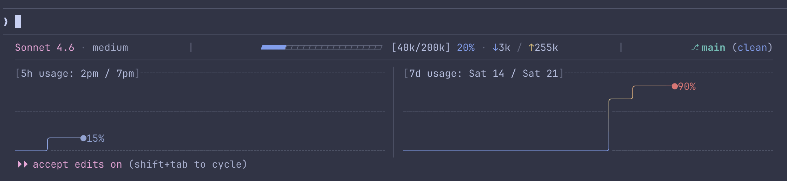
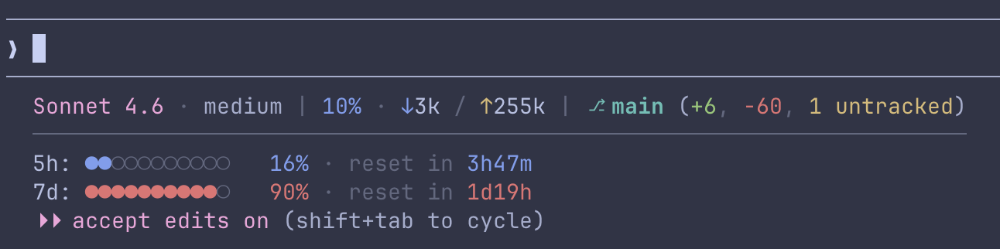

<div align="center">

# ccslgraphs

Just another statusline for Claude Code, this one has graphs.
</div>




## Install

```sh
curl -fsSL https://raw.githubusercontent.com/olmo-francesconi/ccslgraphs/main/install.py | python3
```

Guided installer: choose install path (defaults to `~/.claude/`) and graph style

## Uninstall

```sh
curl -fsSL https://raw.githubusercontent.com/olmo-francesconi/ccslgraphs/main/uninstall.py | python3
```

Removes `~/.claude/ccslgraphs/` and cleans the `statusLine` entry from `settings.json`.
